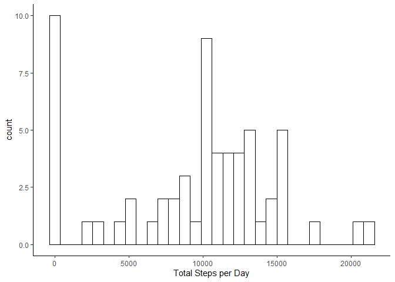
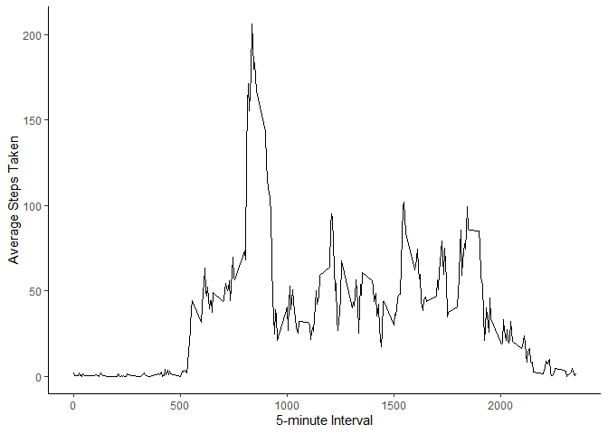
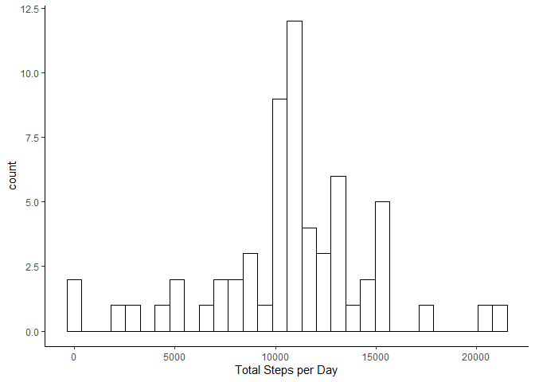
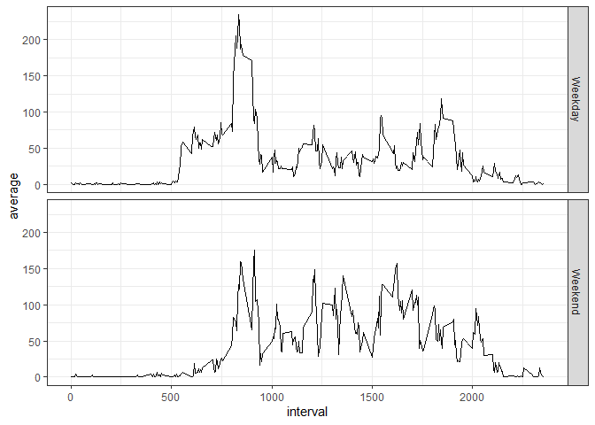

In this peer assessment we will take a deeper look at step data from activity monitoring devices collected between October and November 2012.

## Loading and preprocessing the data

For this assessment we need to read the "activity.csv" file that has the data to be processed. We can achieve this using
the read_csv() function within the readr package (part of the tidyverse package suite)


```r
library(tidyverse)
```

```
## -- Attaching packages ----------------------------------------------------------------------------------------- tidyverse 1.3.0 --
```

```
## v ggplot2 3.3.2     v purrr   0.3.4
## v tibble  3.0.3     v dplyr   1.0.2
## v tidyr   1.1.2     v stringr 1.4.0
## v readr   1.3.1     v forcats 0.5.0
```

```
## -- Conflicts -------------------------------------------------------------------------------------------- tidyverse_conflicts() --
## x dplyr::filter() masks stats::filter()
## x dplyr::lag()    masks stats::lag()
```

```r
dat <- read_csv("./activity.csv")
```

```
## Parsed with column specification:
## cols(
##   steps = col_double(),
##   date = col_date(format = ""),
##   interval = col_double()
## )
```

## What is mean total number of steps taken per day?

To be able to calculate a histogram of the total steps per day, the data needs to be aggregated on a per day basis. We can achieve this using the *summarize* and *group_by* functions within the **dplyr** package to calculate the daily mean and median of steps per day, and then plot the total steps per day using the **ggplot2** package.


```r
daily_summary <- dat %>%
    group_by(date) %>%
    summarize(
        total = sum(steps, na.rm = TRUE),
        mean = mean(steps, na.rm = TRUE),
        median = median(steps, na.rm = TRUE)
        )
```

```
## `summarise()` ungrouping output (override with `.groups` argument)
```

```r
ggplot(daily_summary) +
    geom_histogram(aes(x = total), col = "black", fill = "white") +
    xlab("Total Steps per Day") + 
    theme_classic()
```

```
## `stat_bin()` using `bins = 30`. Pick better value with `binwidth`.
```

<!-- -->

```r
daily_summary
```

```
## # A tibble: 61 x 4
##    date       total    mean median
##    <date>     <dbl>   <dbl>  <dbl>
##  1 2012-10-01     0 NaN         NA
##  2 2012-10-02   126   0.438      0
##  3 2012-10-03 11352  39.4        0
##  4 2012-10-04 12116  42.1        0
##  5 2012-10-05 13294  46.2        0
##  6 2012-10-06 15420  53.5        0
##  7 2012-10-07 11015  38.2        0
##  8 2012-10-08     0 NaN         NA
##  9 2012-10-09 12811  44.5        0
## 10 2012-10-10  9900  34.4        0
## # ... with 51 more rows
```

## What is the average daily activity pattern?

To be able to calculate this daily pattern, we need to group the data by 5-minute interval, and then calculate the average of daily steps per 5-minute interval.


```r
## Aggregate data by 5-minute intervals

daily_pattern <- dat %>% 
    group_by(interval) %>% 
    summarize(average = mean(steps, na.rm = TRUE))
```

```
## `summarise()` ungrouping output (override with `.groups` argument)
```

```r
ggplot(daily_pattern, aes(x = interval, y = average)) +
    geom_line() +
    xlab("5-minute Interval") + 
    ylab("Average Steps Taken") +
    theme_classic()
```

<!-- -->

```r
daily_pattern %>%
    arrange(desc(average))
```

```
## # A tibble: 288 x 2
##    interval average
##       <dbl>   <dbl>
##  1      835    206.
##  2      840    196.
##  3      850    183.
##  4      845    180.
##  5      830    177.
##  6      820    171.
##  7      855    167.
##  8      815    158.
##  9      825    155.
## 10      900    143.
## # ... with 278 more rows
```

We can see from the plot and from the arranged data that the greatest amount of steps taken in a 5-minute interval corresponds to the 835 (8:35) 5-minute interval.

## Imputing missing values

Let's subset the missing values and count them. 


```r
missing <- dat %>%
    filter(is.na(steps))

## Count number of observations

missing %>%
    tally() %>%
    rename("Total NAs" = n)
```

```
## # A tibble: 1 x 1
##   `Total NAs`
##         <int>
## 1        2304
```

We now know there are 2304 missing values. We will fill the missing values with the calculated mean for that 5-minute interval that we calculated before. 


```r
no_missing <- dat

for (i in 1:nrow(no_missing)){
    if (is.na(no_missing$steps[i]) == TRUE) {
        interval <- as.numeric(no_missing[i, 3])
        average <- as.numeric(daily_pattern[which(daily_pattern$interval == interval), 2])
        no_missing[i, 1] <- round(average, digits = 0)
    }
}

no_missing_summary <- no_missing %>% 
    group_by(date) %>%
    summarize(
        total = sum(steps),
        mean = mean(steps),
        median = median(steps)
    ) %>%
    print()
```

```
## `summarise()` ungrouping output (override with `.groups` argument)
```

```
## # A tibble: 61 x 4
##    date       total   mean median
##    <date>     <dbl>  <dbl>  <dbl>
##  1 2012-10-01 10762 37.4     34.5
##  2 2012-10-02   126  0.438    0  
##  3 2012-10-03 11352 39.4      0  
##  4 2012-10-04 12116 42.1      0  
##  5 2012-10-05 13294 46.2      0  
##  6 2012-10-06 15420 53.5      0  
##  7 2012-10-07 11015 38.2      0  
##  8 2012-10-08 10762 37.4     34.5
##  9 2012-10-09 12811 44.5      0  
## 10 2012-10-10  9900 34.4      0  
## # ... with 51 more rows
```

```r
ggplot(no_missing_summary) +
    geom_histogram(aes(x = total), col = "black", fill = "white") +
    xlab("Total Steps per Day") + 
    theme_classic()
```

```
## `stat_bin()` using `bins = 30`. Pick better value with `binwidth`.
```

<!-- -->

With the data estimation, the amount of days in which there were no or very few (<1000) steps taken greatly decreased. Now the distribution shows a peak of days with approximately 10,000 steps taken. Another finding is that in values where data has been fully estimated, the median is of 34.5. That's because we're "building" data out of an average and data is missing in whole-day sections, so days with missing data will have the same distribution.

## Are there differences in activity patterns between weekdays and weekends?

To create this panel plot we need to calculate averages per weekday/weekend and interval. We can use the tools we have used in previous sections:


```r
weekday_data <- dat %>%
    mutate(wday = weekdays(date))

weekday_data <- weekday_data %>%
    mutate(wday = if_else(wday %in% c("Monday", "Tuesday", "Wednesday", "Thursday", "Friday"), "Weekday", "Weekend")) %>%
    mutate(wday = factor(wday, levels = c("Weekday", "Weekend"))) %>%
    group_by(wday, interval) %>% 
    summarize(average = mean(steps, na.rm = TRUE))
```

```
## `summarise()` regrouping output by 'wday' (override with `.groups` argument)
```

Now that we have computed the averages, we can plot them using **ggplot**:


```r
ggplot(weekday_data, aes(x = interval, y = average)) +
    geom_line() + 
    facet_grid(wday ~ .) +
    theme_bw()
```

<!-- -->

You can observe there is a spike present in the early morning of weekdays, which is absent in the weekend time-series plot. This can be attributed to people being up earlier to get ready to work. Between office hours, the average of steps taken is lower in the weekday plot than in the weekend plot, which can be attributed to typical office work. Steps taken are more uniformly distributed over the weekend due to a more free schedule.
